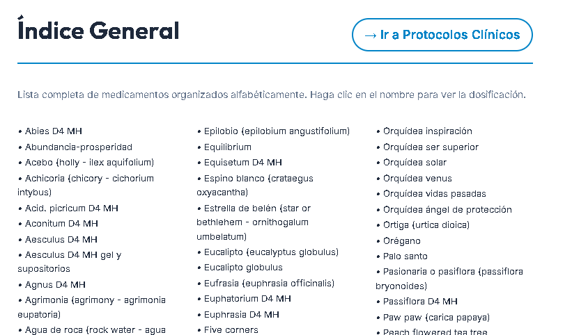

# Bitácora de Avance - Vademécum Libro

## Propuestas para Cliente (Pendientes de Aprobación)

Las siguientes funcionalidades han sido identificadas para potenciar el nuevo diseño del Vademécum Digital y su integración con el ecosistema de Mundo Homeopático v2:

1. **Integración en Astro:**
   - Portar el diseño estético "Elite" del libro a una nueva página o componente dentro del proyecto web principal para mantener coherencia visual total.

2. **Sincronización de Datos:**
   - Asegurar que el sitio web use exactamente los mismos datos (CSV/Google Sheets) que alimentan este libro digital, garantizando que no haya discrepancias de información.

3. **Funcionalidad de Exportación:**
   - Implementar una opción para que los usuarios profesionales (médicos y especialistas) puedan descargar este Vademécum en formato PDF de alta calidad directamente desde la plataforma web.

---

_Nota: Estas tareas se encuentran en estado de propuesta y requieren validación por parte del cliente antes de su implementación técnica._
